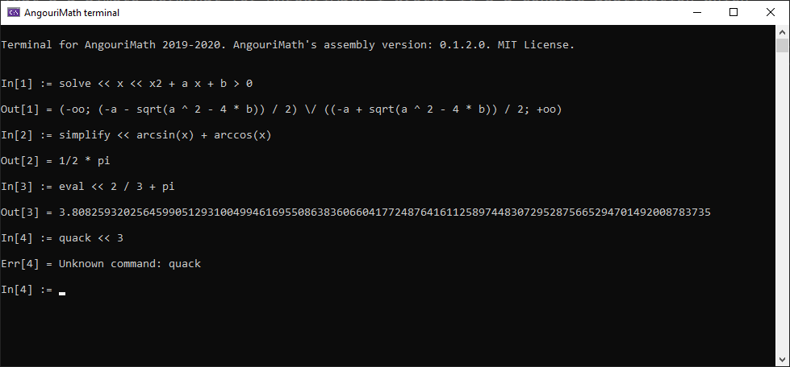

## AMTerminal

That's a simple terminal for AngouriMath I wrote. It's a console application which
can run some AM's commands.



### Syntax

```
[command] << [argument #1] << [argument #2] << ...
```

For example,

```
solve << x << x + 3 = 0 and x > 0
```

or

```
simplify << arcsin(x) + arccos(x)
```